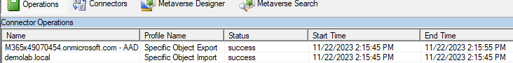

# Hybrid AutoPilot Speed Enhancements
## WaitForUserDeviceRegistration
Pauses device ESP for up to 60 minutes for machine to register with AzureAD.
Add the WaitForUserDeviceRegistration.intunewin app to Intune and specify the following command line:

powershell.exe -noprofile -executionpolicy bypass -file .\WaitForUserDeviceRegistration.ps1

To "uninstall" the app, the following can be used (for example, to get the app to re-install):

cmd.exe /c del %ProgramData%\DeviceRegistration\WaitForUserDeviceRegistration.ps1.tag

Specify the platforms and minimum OS version that you want to support.

For a detection rule, specify the path and file and "File or folder exists" detection method:

%ProgramData%\DeviceRegistration\WaitForUserDeviceRegistration
WaitForUserDeviceRegistration.ps1.tag

Deploy the app as a required app to an appropriate set of devices.

## SyncNewAutoPilotComputersandUsersToAAD_v2

As stated in the script comments:

<blockquote>
    Triggers an Entra Connect (AAD Connect) "Single Object Sync" so that computers
    do not have to wait for the default Entra Connect synchronization interval.

    .DESCRIPTION
    As discussed in https://github.com/steve-prentice/autopilot/issues/4, 
    Microsoft doesn't want customers running Entra Connect Sync more frequently
    than their AllowedSyncCycleInterval, which is currently 30 minutes.
    However, this results in a significant delay in the AutoPilot/OOBE experience
    for Hybrid Azure AD Joined workstations.

    This script looks for computers in a given OU ($BaseOu) with a certificate
    generated more recently than the last Entra sync cycle, as the certificate's
    date is representative of workstations Entra join attempt.

    Run this script every 5 minutes, as a scheduled task from the Microsoft Entra
    Connect (AAD Connect) server.
</blockquote>.
i.e.

## SyncNewAutoPilotComputersandUsersToAAD
The original version is also available, if you do not wish to use the per-device sync.